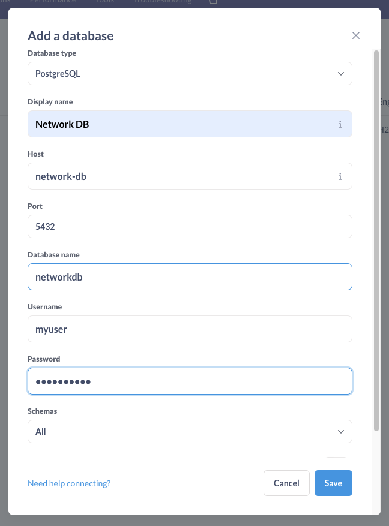

# NetworkHealthCheck

## What does this do?

- Puts the contents of `ping` into Postgres every minute. That's it.

## How do I set it up?

- `docker compose up` to start.
- The DDL in [startup-scripts/schema.sql](./startup-scripts/schema.sql) will only be run if the data directory (in this case, the docker volume) is
empty.
  - See [the docs](https://hub.docker.com/_/postgres#initialization-scripts)
- Once Metabase is up, enter the following info after clicking the "Add Database" button:
  
  - The username and password are the same as those in the [`docker-compose.yml`](./docker-compose.yml) file.
- At the time of this writing, `view_ping_log` doesn't seem to graph well with Metabase. The below query can be used/modified to access the the JSON
within `ping_log`:
  ```sql
  select
    createdateutc at time zone 'America/Denver' as "Timestamp (Mountain Time)",
    AVG((output->'packet_loss_percent')::numeric) over (order by createdateutc rows between 5 preceding and current row) as "5 Minute Ping Packet Loss Average"
  from ping_log
  ```
